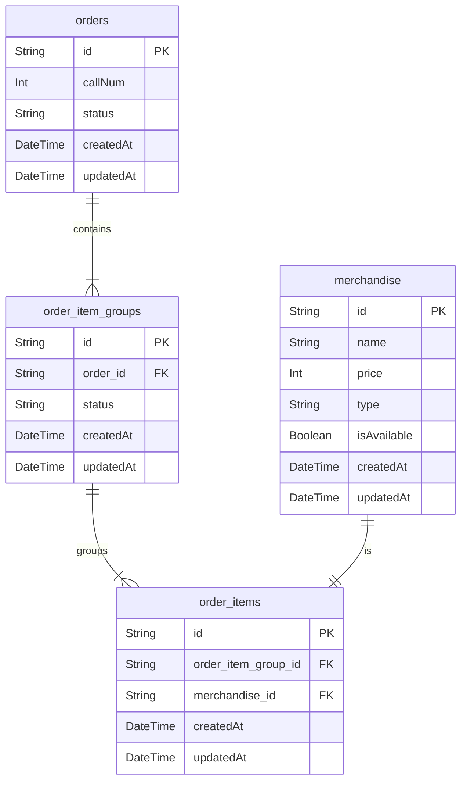

# Data Model

This document defines the data structures for the application, reflecting a hierarchical model of Order -> Group -> Item.

## 1. Order (注文)
Manages the entire order for a single customer. It contains multiple `OrderItemGroup`s.

| Field | Type | Description |
|---|---|---|
| `id` | String (UUID) | Unique identifier for the order. |
| `callNum` | Integer | A sequential, human-readable number for calling out. |
| `status` | String | The overall, customer-facing status of the order (e.g., `PAID`, `COOKING`). |
| `createdAt` | DateTime | Timestamp of creation. |
| `updatedAt` | DateTime | Timestamp of last update. |

## 2. OrderItemGroup (注文商品グループ)
A group of `OrderItem`s that change status together (e.g., a single bowl and its toppings).

| Field | Type | Description |
|---|---|---|
| `id` | String (UUID) | Unique identifier for the group. |
| `orderId` | String (UUID) | Foreign key to the parent `Order`. |
| `status` | String | Internal status for kitchen operations (`NOT_READY`, `PREPARING`, `READY`). |
| `createdAt` | DateTime | Timestamp of creation. |
| `updatedAt` | DateTime | Timestamp of last update. |

## 3. OrderItem (注文商品)
Represents a single line item (e.g., a base ramen, a topping, a discount). It must belong to an `OrderItemGroup`.

| Field | Type | Description |
|---|---|---|
| `id` | String (UUID) | Unique identifier for this specific item in the order. |
| `orderItemGroupId` | String (UUID) | Foreign key to the parent `OrderItemGroup`. |
| `merchandiseId` | String (UUID) | Foreign key to the `Merchandise` table. |
| `createdAt` | DateTime | Timestamp of creation. |
| `createdAt` | DateTime | Timestamp of creation. |
| `updatedAt` | DateTime | Timestamp of last update. |

## 4. Merchandise (商品)
Defines all sellable items, including bowls, toppings, and special items like discounts.

| Field | Type | Description |
|---|---|---|
| `id` | String (UUID) | Unique identifier for the merchandise. |
| `name` | String | Display name of the item. |
| `price` | Integer | The price of the item. Can be negative for discounts. |
| `type` | String | Type of item, e.g., `BASE_ITEM`, `TOPPING`, `DISCOUNT`. |
| `isAvailable` | Boolean | Whether the item is currently available for purchase. |
| `createdAt` | DateTime | Timestamp of creation. |
| `updatedAt` | DateTime | Timestamp of last update. |

## Entity Relationship Diagram (Mermaid)

## 5. Constraints and Business Rules

- **Rule 1**: An `OrderItemGroup` can contain at most one `Merchandise` item of type `BASE_ITEM`.
- **Rule 2**: A `Merchandise` item of type `TOPPING` or `DISCOUNT` can only be added to an `OrderItemGroup` that already contains a `BASE_ITEM`.
